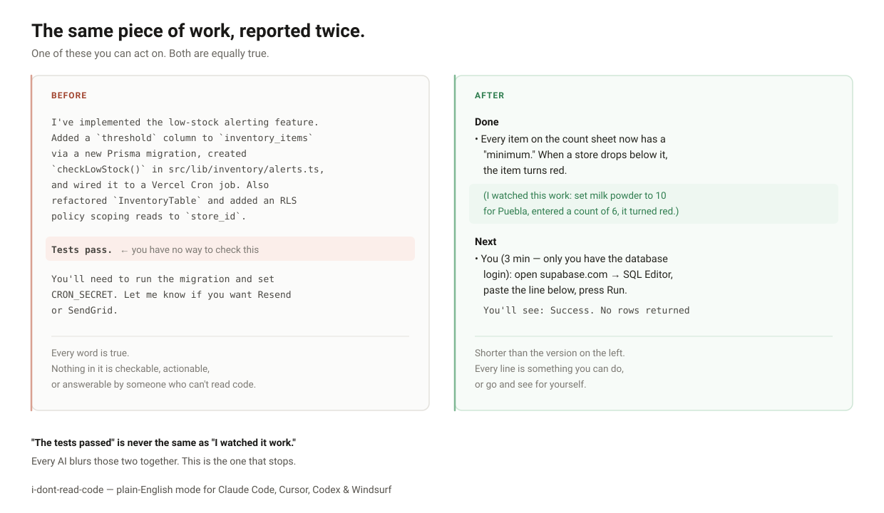

# I Don't Read Code（我不看代码）

**给 Claude Code、Cursor、Codex、Windsurf 装一个「说人话」模式。** 写给那些不写代码、但真的在做产品的人：
创始人、设计师、运营、以及所有 vibe coding 的人。

装一次，一直生效。你不需要每次去调用它。



---

## 问题在哪

你让 AI 帮你做个功能，它回你：

> I've implemented the low-stock alerting feature. Added a `threshold` column to `inventory_items`
> via a new Prisma migration, created `checkLowStock()` in `src/lib/inventory/alerts.ts`, and wired
> it to a Vercel Cron job. Also refactored `InventoryTable` and added an RLS policy scoping reads to
> `store_id`. Tests pass. You'll need to run the migration and set `CRON_SECRET`.

每一句都是真的。但对你来说，一句有用的都没有。

你看不出到底哪里变了，也看不出这东西到底能不能用。"run the migration" 你不知道怎么做，
"Resend 还是 SendGrid" 你也答不上来。于是你回一句"好的，谢谢"，转头告诉同事可以用了，
周四出了问题才发现根本没好。

## 装上之后，同样这一轮

> **已完成**
> - 盘点表上的每个物料现在都有一个"最低库存"。门店低于这个数，这一行会变红。
>   （我亲眼看着它跑通了：把普埃布拉店的奶粉设成 10，录了个 6 进去，那行变红了。）
> - 顺带做了一件你看不见的事：店长现在只能看到自己门店的数字，看不到另外 11 家。
>   万一这个坏了，一个店长就能截图看到别家的毛利。
>   （只有机器检查过——我直接核对了这条规则。还没有真人以店长身份登录过。）
>
> **需要你决定**
> - 早上 8 点那条汇总发给谁？**A：只发店长** —— 清净，但店长要是没看，总部要等到东西真断货才知道。
>   **B：店长和你都发** —— 12 家店大概每天 5 到 15 行，合并成一条，不是 12 条。
>   我建议先用 B 撑一个月，你正好看看那些"最低库存"定得合不合理，之后再切回 A。
>   你不回我就按 B 做；以后想换成 A，我两分钟就能改。
>
> **下一步**
> - 你（大概 3 分钟——我没有你数据库的登录权限，只有你有）：打开 supabase.com，
>   进入名字叫 `mixue-inventory` 的项目，点左边菜单里的 **SQL Editor**（你屏幕上就是这个英文），
>   把下面这段粘进去，按 **Run**。这一步是给每个物料加一个空的数字，
>   不会动你各家门店已经录进去的盘点数据。
> ```sql
> alter table inventory_items add column minimum_qty integer not null default 0;
> ```
> 成功的话你会看到一个绿框，写着 `Success. No rows returned`。如果是红的，把红字整段复制过来给我。
> - 我（等你弄完之后）：根据最近 30 天给 12 家店都定好初始的最低库存，上线前先把清单给你过目。

比上面那版还短。而且每一行你都能照着做，或者自己去核对。

---

## 怎么装

在 Claude Code 里敲这两行：

```
/plugin marketplace add WinterDDo/i-dont-read-code
/plugin install i-dont-read-code@i-dont-read-code
```

装完就自动开了。不用去设置里选，不用配置，也没有需要记住的命令。

想确认装好没有：开一个新对话，输入 `skill check`。每个部件会各自报到一行，
你一眼就能看出装上了哪些：

```
i-dont-read-code v0.2.0 is on
Always-on rules: yes
Per-turn reminder: on
```

（还有第四行 `Deep examples: loaded`，只有在真正需要更深内容时才会出现。看不到是正常的。）

**要花多少钱。** 一直生效的那部分是免费的，它直接写进了 Claude 读你消息的方式里。
每轮的提醒会给你发出的每条消息附加大约 400 个词的说明：正常使用下每天几美分，
但也不是完全没有。说一句 `turn off the reminder` 就能去掉，其他部分照常工作。
不会有任何数据被传到外部，全部在你自己的机器上跑。

用 Cursor、Codex 或 Windsurf？看 [INSTALL.zh-CN.md](INSTALL.zh-CN.md)。

---

## 它到底做了什么

**1. 告诉你什么变了，而不是它做了什么。** 文件名、函数名、库名会从回复里删掉——是删掉，不是简化。
留下的是：一个真正在用这个软件的人，会注意到哪里不一样了。

**2. 没验证过的东西，不许说"做好了"。** 这是最关键的一条，也是别的工具都没做的。
现在每一句"完成了"后面，必须跟三个标记里的一个：

| 标记 | 真实含义 |
|---|---|
| `（我亲眼看着它跑通了：……）` | 它真的操作了一遍，看到了结果。而且必须写清楚做了什么、看到了什么。 |
| `（只有机器检查过——……）` | 测试过了。**但没有任何人真正用过。** 这是两回事。 |
| `（没跑过——……）` | 代码写了，没运行过。 |

"测试通过"属于中间那个，永远不是第一个。这个区别在普通的 AI 回复里是看不出来的，
而它恰恰决定了：你现在到底能不能告诉团队"这个可以用了"。

**而且这个标记是可核对的，不只是嘴上说说。** 让做事的那个 AI 自己给自己的工作打标记，
本质上是"靠自觉"——而这恰恰就是整个项目要解决的问题。
所以它会记录真正跑过哪些操作，只有当记录里有对应的那一条时，才允许写"我亲眼看着它跑通了"。
你随时可以问 **"what have you actually checked?"**（你到底验证过什么），它会用大白话把清单摆给你看。

*这在硬盘上意味着什么：* 你的项目里会有一个叫 `.i-dont-read-code` 的文件夹，
里面是一个纯文本记录，记着跑过哪些命令、改过哪些文件，只存在你自己的机器上。
不会传到任何地方。你随时可以把这个文件夹删掉，它会自己重建。

**3. 只问你答得上来的问题。** 不会再问"用 Postgres 还是 SQLite"——你答不上来，只能回"你定"，
然后它就再也不问你任何事了。取而代之的是：两个选项，各自用钱、时间、风险、
或者你的员工和顾客会有什么体验来说明，再加上它的建议和理由。

**4. 交代给你的事，有明确的终点。** 需要你亲自做的事，它会告诉你去哪、粘什么、
**做对了会看到什么**、大概多久、以及为什么这事只能你来。
如果它说不出"成功长什么样"，这条指令就不允许发出来。

**5. 它替你记着，你不用记。** 项目做得越久，这条越重要。
你的项目文件夹里会有两个大白话文件，你随时能自己打开看：

- **`STATUS.md`** —— 哪些是真的能用了、哪些**还没验证过**、哪些在等你、
  上次之后发生了什么、以及你已经做过的决定（免得同一个问题被问第二遍）。
  一件事只有在**你说你亲眼看到它能用**之后，才会从"还没验证过"里移出来——测试通过不算。
  另外，两周前交代给你但一直没回音的事，它会提醒你一次。
  被悄悄遗忘的待办，正是"还没验证"变成"应该没问题"的方式。
- **`PROJECT-CARD.md`** —— 你的软件是用什么做的、放在哪、每月付给谁多少钱、
  换个开发者接手需要给他什么。说一句 `make my project card` 就会生成。

---

## 它**不**做什么

**不会把话说得含糊。** 在这套规则里，含糊比术语更严重。"我优化了登录体验"和
"I refactored AuthProvider to useReducer"是一样糟的——前者只是更难被你发现而已。
规则的方向是让每句话变得**你能去核对**，不是变软。

**不会改你的代码。** 它只改 AI 跟你说话的方式。代码、注释、commit、PR 全部保持正常写法——
因为将来会有别的开发者读它们。该用复杂方案的时候，它照样用复杂方案，只是用简单的话讲清楚后果。

**不会把危险的事情藏起来。** 花钱、删数据、把数据公开、给真实顾客发消息——
这些都不许简化。在动手**之前**，你会先拿到最坏情况的大白话说明，单独问你一次，然后它会等。
你不回话，永远不算你同意。

**不会把细节锁起来。** 说一句 **"details"** 或者 **"把报错发我"**，
你就能拿到那一条回复的完整技术版本——真实路径、完整报错——然后自动恢复正常。
这个版本你是需要的：拿去搜索，或者转给会看的人。

**不会让你越用越依赖。** 它会帮你维护一张大白话的"家底清单"：你的软件用什么做的、放在哪、
每月付多少钱、换个开发者接手需要给他什么。你应该随时能把自己花钱做出来的东西讲清楚、
算得出成本、也交得出去。

---

## 关于语言

你用什么语言写，它就用什么语言回。中文的术语依然是术语，所以规则管的是意思，不是字面。
但凡是你会在自己屏幕上看到的字，一律保留它本来的样子——
中文回复里那个按钮还是叫 `SQL Editor`，因为你屏幕上写的就是这个。

English: [README.md](README.md)

---

## 它是怎么实现的

<details>
<summary>给想看细节的人</summary>

一共四层，因为 Claude Code 里没有任何**单一**机制是真正一直生效的。

| 层 | 是什么 | 为什么需要 |
|---|---|---|
| Output style | `output-styles/plain-english.md`，带 `force-for-plugin: true` | 直接改写 system prompt，对每一条回复都生效；装上就自动开启，不需要用户去选；上下文被压缩后依然存在。`keep-coding-instructions: true` 保证写代码的能力完全不受影响。 |
| Skill | `skills/i-dont-read-code/` | 放深度内容：完整示例、反复出现的决策岔路、交接说明书、中文语感。需要时才加载。 |
| Hooks | `UserPromptSubmit`、`SessionStart`、`PostToolUse(+Failure)` | 每轮重新注入规则卡（长对话到第 45 轮还能守住）；每个新会话自动带上 `STATUS.md` 和 `PROJECT-CARD.md`，并提醒超过 7 天没回音的待办；记录真正跑过什么，让信任标记变得可核对。 |
| 可移植副本 | `portable/` | Cursor rules、`AGENTS.md`、`CLAUDE.md`——给别的工具用，也给 hook 跑不起来的网页版用。 |

`PostToolUse` 的输出只进调试日志、模型看不到，所以操作记录写在文件里，
再由 `UserPromptSubmit`（它的输出模型是能看到的）把最近几条送回去。
正是这一圈来回，让「我亲眼看着它跑通了」从一句承诺变成一条可查的引用。

`scripts/check-drift.sh` 会检查 18 条规则是否都出现在 7 个层里，并且跑在 CI 上——
因为「它们不会各自跑偏」这句话在 v0.1 里只是个愿望，而且当时就已经不成立了。

只做成一个 Skill 是不够的。Skill 的正文是按需加载的，而且对话被压缩时，
每个 Skill 只有前 5,000 token 会被重新挂回来，还要跟别的 Skill 共享 25,000 token 的额度，
按最近使用顺序填——也就是说，恰恰是在最需要它的长对话里，它可能被整个丢掉。
Output style 写在 system prompt 里，没有这个问题。

`RULES.md` 是唯一的源头。output style、hook、以及所有可移植副本都是同一套规则，
不会各自跑偏。

</details>

---

## 想帮忙的话

最有价值的贡献是**真实的前后对照**：你收到过的一条看不懂的回复，以及你希望它怎么说。
开个 issue 把两段都贴上来。这套规则就是从这种材料里长出来的。

## 许可

MIT，见 [LICENSE](LICENSE)。
